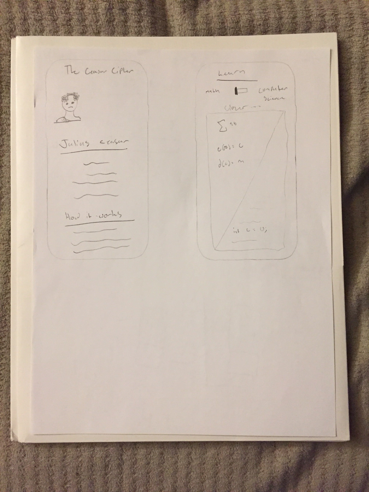
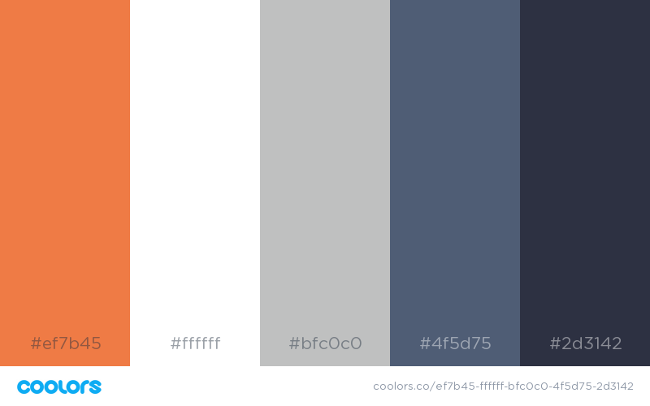

# Project: crypt #
##### Version 1.0 #####

## What is this project? ##

Kevin and I are computer science students at Arizona State University with a passion in cryptography and mathematics. The goal of this project is to design a complete cryptographic toolkit for encrypting and decrypting classical ciphers, as well as a way to teach people about cryptography and cybersecurity. We started implementing our code in Java and we are now adding a python module as well. We are now working on a mobile app that will be available on both android and iOS.

## Prototypes: ##

The color scheme will be:

## Creators: ##

Kevin Lough

Luke Mains
